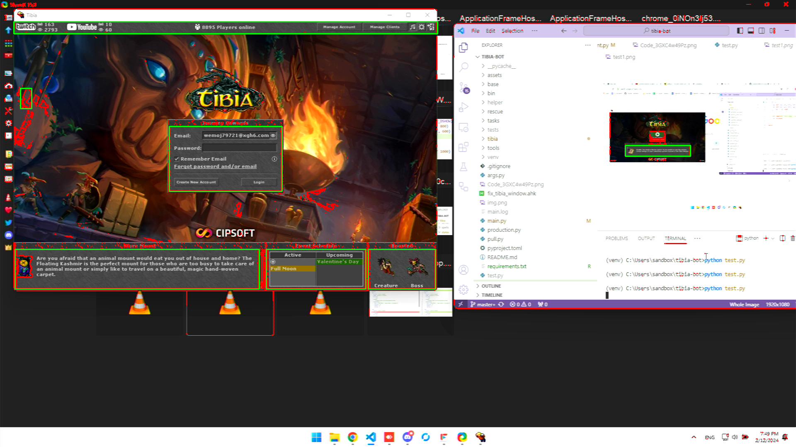

# Simple Tibia game window and widgets detection

# How To Run:-
## Installation
### With Virtual Environment
```console
python -m venv .venv
```
    activating virtual environment
```console
.venv/Scripts/activate
.venv/bin/activate
```
    installing dependency
```console
python -m pip install -r requirements.txt
```
### without virtual environment
```console
python -m pip install -r requirements.txt
```

### If you have make
```console
make detect
```
### else
    activate the virtual environment first if you have created one
    then run this,
    if the opencv and numpy is installed system-wide you can just run

```console
python ./src/detector.py
```

# To time it
    The value is arbiratoy, it just need not to be falsy value
    with make
```console
TIMEIT=1 make detect
```
    direct
```console
TIMEIT=1 python ./src/detector.py


# Currently 2024-Feb-15

